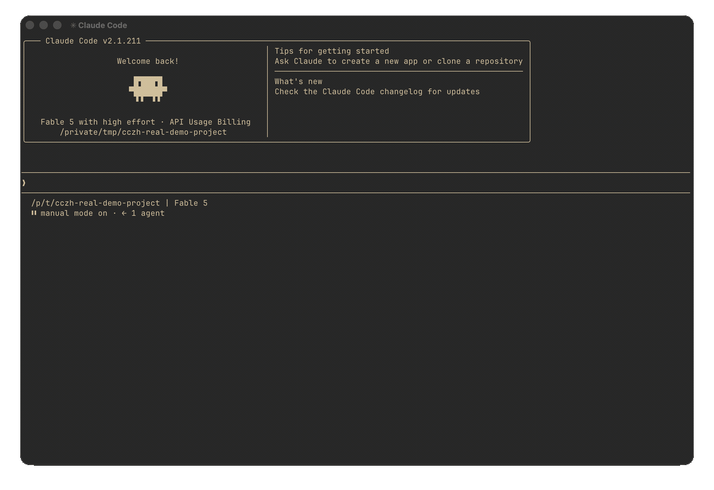

<div align="center">

# claude-code-zh-cn

**Claude Code 简体中文本地化插件**

让终端里的 AI 编程助手说中文 🇨🇳

**一条命令，把 Claude Code 的终端界面、等待提示、系统通知和默认回复切换为简体中文。**

187 个趣味 spinner 动词，41 条中文提示，回复耗时中文化；另有 2007 条界面翻译。

[](https://github.com/taekchef/claude-code-zh-cn)
[](https://taekchef.github.io/claude-code-zh-cn/)
[](./LICENSE)
<!-- readme-support-window:badges:start -->
[](./docs/support-matrix.md)
[](./docs/support-matrix.md)
[](./docs/support-matrix.md)
[](./docs/support-matrix.md)
<!-- readme-support-window:badges:end -->
[](https://github.com/taekchef/claude-code-zh-cn/releases)

**macOS · Linux · WSL · Windows**

**一行远程安装 · 更新后自动修复 · 卸载不丢配置**

</div>

---

## ⭐ 快速导航

| 我想做什么 | 直接查看 |
|---|---|
| 先看看汉化效果 | [效果预览](#preview) |
| 立即安装 | [30 秒安装](#quick-install) |
| 临时切回英文或彻底卸载 | [恢复英文界面](#back-to-english) |
| 确认系统和版本是否支持 | [支持范围](#支持范围) |
| 排查“没汉化”或运行报错 | [验证与 doctor 诊断](#验证) |

<a id="preview"></a>

## ⭐ 效果预览



> **真实 Ghostty 录制**：同一台 Mac、同一个 Claude Code `2.1.211`，先运行安装前备份的原版可执行文件，再运行当前中文补丁版。动图只做缩放和前后切换，没有重绘或仿造终端内容。

**安装前：**

```text
⠙ Photosynthesizing...

  Tip: Press Shift+Tab to switch between default, auto-accept edits, and plan modes
```

**安装后：**

```text
⠙ 光合作用中...

  💡 按 Shift+Tab 在默认模式、自动接受编辑模式和 Plan 模式之间切换
```

更多画风：

```text
⠙ 蹦迪中...          ⠙ 七荤八素中...         ⠙ 搞事情中...
⠙ 瞎忙活中...        ⠙ 花里胡哨中...         ⠙ 变魔术中...

  琢磨了 1分23秒
```

187 个趣味 spinner 动词，41 条中文提示，回复耗时中文化，AI 默认中文回复。**装完即用。**

<a id="quick-install"></a>

## ⭐ 30 秒安装

已经安装 Claude Code？运行：

```bash
curl -fsSL https://github.com/taekchef/claude-code-zh-cn/releases/latest/download/install-remote.sh | bash
```

重启 Claude Code，看到“思考中”“光合作用中”等中文提示即安装成功。还没有 `claude` 命令，请先安装 [Claude Code](https://github.com/anthropics/claude-code)。

> **安全边界**：安装前会备份原文件。补丁、重打包或启动自检失败时会保留或恢复原文件；遇到暂未适配的新文案时，对应内容保持英文，不影响 Claude Code 正常启动。

如果它让你的 Claude Code 更顺手，欢迎点一下右上角 **Star**，这会帮助更多中文用户发现它。

<a id="back-to-english"></a>

## ⭐ 临时切回英文或卸载

需要对照英文教程时，当前最稳妥的临时切换方法是：**完整卸载汉化，使用完英文界面后再重新安装**。

> **不要只运行 `claude plugin disable`。** 本项目还会写入中文设置并修改 CLI 硬编码文字（Layer 4 Patch）；只停用插件不会清理这些设置，也不会还原 CLI，因此界面仍可能是中文。

macOS、Linux 或 WSL 远程安装用户运行：

```bash
curl -fsSL https://github.com/taekchef/claude-code-zh-cn/releases/latest/download/uninstall-remote.sh | bash
```

本地源码安装用户运行 `./uninstall.sh`。Windows 用户先关闭所有 Claude Code 窗口；如果插件市场安装时没有保留本项目目录，先下载源码，再运行卸载脚本：

```powershell
git clone https://github.com/taekchef/claude-code-zh-cn.git
cd claude-code-zh-cn
powershell -NoProfile -ExecutionPolicy Bypass -File uninstall.ps1
```

已有本地源码的 Windows 用户直接在原目录运行最后一行即可。卸载脚本会还原 CLI 备份，移除中文设置、Hook 和插件注册，同时保留其他 Claude Code 配置。重启 Claude Code 后即为英文界面。

> 卸载脚本无法判断 `language`、`spinnerTipsEnabled`、`spinnerTipsOverride`、`spinnerVerbs` 是插件写入还是你手动配置，因此会统一删除。如果你手动维护过这些字段，请先自行备份需要保留的值。

如果安装时同意把中文设置同步到 CC Switch，还需在 CC Switch 的 Claude“通用配置”中删除本插件添加的 `language`、`spinnerTipsEnabled`、`spinnerTipsOverride`、`spinnerVerbs`，否则下次切换供应商时这些设置可能再次写回。如果这些字段原本就是你手动配置的，请只暂时关闭“写入通用配置”，不要删除。

要重新启用中文，macOS、Linux 或 WSL 重新运行上面的 [30 秒安装](#quick-install) 命令；Windows 在刚才的源码目录重新运行 `install.ps1`。

## 为什么做这个？

Claude Code 是一个很棒的终端 AI 编程助手，但它没有中文界面。UI 文字主要硬编码在一个 13MB 的 `cli.js` 里，没有 i18n 基础设施。

官方短期内不太可能加中文支持。所以我做了这个插件，通过四层机制（设置注入 + Hook 系统 + 插件系统 + CLI Patch）实现中文化，**自动检测安装方式，更新后自动修复**。遇到还没验证过的新版本也不怕：插件会自动降级，翻不了的部分保持英文，CLI 绝不会坏。

## 安装说明

### 推荐：插件市场安装（macOS / Linux / Windows 通用）

最快的方式——不依赖本地仓库，两条命令搞定。**三平台通用**，只要已经有 `claude` 命令：

```bash
# 1. 添加本项目的插件市场
claude plugin marketplace add --scope user https://github.com/taekchef/claude-code-zh-cn

# 2. 安装中文本地化插件
claude plugin install claude-code-zh-cn@claude-code-zh-cn --scope user
```

装好后**重启一次 Claude Code**：session-start hook 会自动把 spinner 动词/提示/界面中文化配置合并进 `settings.json`，并自动 patch 已验证版本的 CLI 硬编码文字。

> **完整覆盖检查**：安装后可直接运行 `zh-cn-setup` skill（在 Claude Code 里说「帮我运行 zh-cn-setup」）。它会补齐安全的 settings 配置、报告 CLI patch 与 CC Switch 状态，并为 skill 描述等不能在当前进程内安全完成的操作给出可复制的终端命令。
>
> **spinner/界面仍是英文？** 如果重启后 spinner 仍是英文，也可运行增强安装 skill：在 Claude Code 里说「帮我运行 zh-cn-setup」或手动执行：
>
> ```bash
> node "${CLAUDE_PLUGIN_ROOT}/skills/zh-cn-setup/scripts/setup.js"
> ```
>
> 该脚本会从插件内置数据补齐缺失的 spinner 配置、检测并同步 CC Switch 通用配置（需授权）、报告 patch 状态，并输出 skill 描述汉化命令。**只补齐缺失项，绝不覆盖你已有的手动配置。**
>
> Skill 描述默认不自动改写：同一个 `description` 既显示在菜单里，也用于 model 判断是否触发 skill。先运行脚本输出的 `--dry-run` 命令检查范围，再执行翻译命令。CC Switch 管理的 skill 若不在 `~/.claude` 下，请把其真实目录通过 `ZH_CN_SKILL_I18N_EXTRA_ROOTS` 传入；Windows 多个目录用分号分隔，macOS/Linux 用冒号分隔。译文会保留英文备份，可用 `node "${CLAUDE_PLUGIN_ROOT}/skill-i18n/restore.js" --all` 还原。
>
> **CC Switch 数据库里的 skill 描述仍是英文？** `ZH_CN_SKILL_I18N_EXTRA_ROOTS` 只翻译 `SKILL.md` 文件本体，不会写 CC Switch 的 `~/.cc-switch/cc-switch.db`。检测到 `skills` 表中描述仍为英文、但对应 `SKILL.md` 已翻译为中文时，`zh-cn-setup` skill 会提示运行可选工具 `cc-switch-descriptions.js`：默认只读预览，`--apply` 才写入（自动备份数据库并输出还原命令）：`node "${CLAUDE_PLUGIN_ROOT}/skills/zh-cn-setup/scripts/cc-switch-descriptions.js"`。CC Switch 管理界面、Claude Code `/skills` 面板与 model 自动触发共用同一份 `description`，请先预览再决定。

> **Windows native .exe 用户**：如果当前 Claude Code 是 2.1.113+ native `.exe`，patch 需要先 `npm install -g node-lief`。未安装时 Layer 4 CLI Patch 会跳过（spinner/界面中文化等 Layer 1~3 不受影响）。

### 完整安装脚本（本地开发 / 离线 / 旧版 Claude Code）

首屏命令会从本项目最新 GitHub Release 下载源码包，然后执行同一套 `install.sh`。它和官方安装器的区别：

| 命令 | 装什么 | 什么时候用 |
|------|--------|------------|
| `curl -fsSL https://github.com/taekchef/claude-code-zh-cn/releases/latest/download/install-remote.sh \| bash` | 中文本地化插件 | 已经有 `claude` 命令，只想安装/更新中文插件 |
| `curl -fsSL https://claude.ai/install.sh \| sh` | Claude Code 本体 | 还没有 `claude` 命令，或要先安装官方 CLI |

远程安装会优先把本项目登记到 Claude Code 插件管理器；当前 CLI 不支持正式注册时，才启用等价的独立 Hook 兜底，不需要保留本地 clone。

如果你要改翻译或调试脚本，再用本地源码安装：

```bash
git clone https://github.com/taekchef/claude-code-zh-cn.git
cd claude-code-zh-cn
./install.sh
```

安装脚本会自动：

- ✅ 备份现有 `~/.claude/settings.json` 和 `cli.js`（或原生二进制）
- ✅ 合并中文设置到 settings.json
- ✅ 检测到 CC Switch 通用配置缺少中文设置时，先询问用户；同意后才同步
- ✅ 优先通过 Claude Code 插件管理器登记 marketplace 并启用正式插件；注册不可用时才安装独立备用 Hook
- ✅ 已验证版本直接使用公开证据；更高 native 版本也先本机自检。可 patch 硬编码文字（2040 条翻译；代表版本 `2.1.112` 实测 1695 处有效 patch）
- ✅ 缺少 `node-lief`、native 格式变化、提取失败或自检失败时，只跳过 Layer 4；Layer 1~3 和 Claude Code 本体继续可用

### Windows 原生安装（完整脚本）

```powershell
git clone https://github.com/taekchef/claude-code-zh-cn.git
cd claude-code-zh-cn
powershell -NoProfile -ExecutionPolicy Bypass -File install.ps1
```

install.ps1 会自动完成与 install.sh 相同的步骤：正式插件注册、依赖检查、Settings 合并、CLI Patch 和失败回滚。需要 PowerShell 5.1+（Windows 10/11 自带）。

> **Windows native .exe 用户先装 node-lief**：如果当前 Claude Code 是 2.1.113+ native `.exe`，请先运行 `npm install -g node-lief` 再装插件。未安装时 Layer 4 CLI Patch 会跳过，Layer 1~3 不受影响。也可以继续通过 [WSL](https://learn.microsoft.com/zh-cn/windows/wsl/install) 使用 `install.sh`。

Claude Code 在 Windows 更新后，插件不会现场改写正在运行并被系统锁定的 `claude.exe`。先照常使用；方便时关闭所有 Claude Code 窗口，再回到本项目目录重跑上面的 `install.ps1`，安装器会完成补丁、启动自检和失败回滚。


### 各安装方式的中文化程度

<!-- readme-support-window:install-advice:start -->
| 安装方式 | 中文化程度 |
|---------|-----------|
| `npm install -g @anthropic-ai/claude-code@2.1.112` | 最完整（推荐） |
| `npm install -g @anthropic-ai/claude-code`（latest） | macOS / Windows native 新版先本机自检；Linux native 仅启用已发布窗口 |
| `curl -fsSL https://claude.ai/install.sh \| bash -s 2.1.112` | 官方安装器指定已验证旧版本（需要 `node-lief`） |
| `curl -fsSL https://claude.ai/install.sh \| sh`（latest） | macOS 新版先本机自检；Linux native latest 只保留 Layer 1~3 |
| `curl -fsSL https://claude.ai/install.sh \| bash -s 2.1.220` | Linux x64 glibc 已验证版本（需要 `node-lief >=1.3.0`）；不含 arm64、musl 或 latest |
| `powershell -File install.ps1` | Windows：旧 npm cli.js 最完整；native .exe `2.1.113 - 2.1.224` 内已验证版本需 `node-lief`；Claude 更新后关闭所有窗口并重跑 |

> **native binary 说明**：官方安装器和新版 npm 包装到的是 native 二进制。插件会提取其中的 JS → 翻译 → 写回，并做启动自检；补丁、重打包或自检失败会恢复原文件。macOS arm64 已验证 `2.1.113 - 2.1.221` 内的版本（完整清单见[支持矩阵](./docs/support-matrix.md)）；更高版本也会本机自检，需要 `node-lief`。Linux x64 glibc 仅启用 `2.1.220`，需要 `node-lief >=1.3.0`，不尝试 provisional latest。macOS 可在新会话安全补丁；Windows 不热改运行中的 exe，更新后需关闭窗口并重跑 `install.ps1`。

安装脚本会自动检测安装方式，无需手动选择。
<!-- readme-support-window:install-advice:end -->

### 前置要求

- Node.js（CLI Patch 需要）
- 可选：jq（更精准的 JSON 合并）
- 可选：`node-lief`（native 二进制适配需要：`npm install -g node-lief`；旧版 npm cli.js 路径不需要）

### 验证

重启 Claude Code 后，发送任意请求。如果看到 spinner 显示“思考中”、“光合作用中”等中文，说明 Layer 1~3 已生效。

不确定 Layer 4 是否生效、或 UI 仍是英文时，运行诊断脚本（会检测安装形态、settings、patch 记录和 `patch.log` 里的失败原因，并给出下一步命令）：

```bash
./doctor.sh                                            # macOS / Linux / WSL（仓库内）
bash ~/.claude/plugins/claude-code-zh-cn/bin/doctor    # 只有已安装插件时
```

```powershell
powershell -NoProfile -ExecutionPolicy Bypass -File .\doctor.ps1   # Windows
```

加 `--json` 得到机器可读输出；退出码 `0` = 无阻塞项，`1` = 需要处理。

如果是请求报错（403、空响应、`ECONNREFUSED` 等）而不是界面英文，那通常是 provider / 代理 / 网关链路问题，不是汉化没生效。可以把报错原文交给 doctor 分流：

```bash
./doctor.sh --runtime-error 'API returned an empty or malformed response (HTTP 200)' --json
```

### 更新

Claude Code 更新后，npm / macOS native 安装会在首次会话启动时**自动检测版本变更并重新 patch**；Windows native 会保留原版可用，并提示关闭窗口后重跑安装器。新版先本机自检；只有格式、依赖、提取或自检失败才跳过原生 Layer 4，不会让 CLI 失效。

插件本体发布新 Release 后，正式安装态由 Claude Code 插件管理器更新。独立兜底安装只做限时检查并提示，不会在会话启动途中原地覆盖自身；本地源码安装用户在会话结束后运行 `git pull && ./install.sh`（Windows：`git pull` 后重跑 `install.ps1`）。

## 支持范围

<!-- readme-support-window:support-systems:start -->
| 平台 / 安装形态 | 已验证版本窗口 | 说明 |
|------|-----------|------|
| macOS / Linux / WSL · npm 全局安装 | `2.1.92 - 2.1.112` | 翻译最完整；launcher 启动前自修复 + `session-start` 兜底 |
| macOS · 官方安装器（native） | `2.1.110 - 2.1.112` | 需要 `node-lief` |
| macOS · native binary（arm64） | `2.1.113 - 2.1.221` 内的已验证版本 | 需要 `node-lief`；个别版本未收录，见支持矩阵 |
| Linux · native binary（x64 glibc） | `2.1.220 - 2.1.220` | 需要 `node-lief >=1.3.0`；仅该版本，不含 arm64、musl 或 latest |
| Windows · npm（PowerShell） | `2.1.92 - 2.1.112` | 用 install.ps1，需 PowerShell 5.1+ |
| Windows · native .exe（x64） | `2.1.113 - 2.1.224` 内的已验证版本 | 需要 `node-lief`；个别版本未收录，见支持矩阵 |
| Linux · 其他官方安装器形态 | 暂无已验证版本 | 仅 Layer 1~3 生效 |

> - **macOS / Windows 版本号不是运行门禁**：高于已知 native 下限、且仍能被识别的新版会先在本机临时提取、翻译、重打包并执行启动自检；通过后才替换。已有词条继续中文，新文案原样保留英文。
> - **Linux 不走 provisional**：Linux x64 glibc 仅启用已发布的 `2.1.220`；arm64、musl 和 latest 不执行 CLI Patch。
> - **失败不伤 CLI**：补丁、重打包或启动自检任一步失败，都会保留或恢复原文件；失败只影响中文覆盖，不影响 Claude Code 使用。
> - **Windows 不热改运行中的 exe**：Claude Code 更新后先保持原版可用；关闭所有 Claude Code 窗口，再按 Windows 安装命令重跑 `install.ps1`，由安装器补丁并自检。
> - **格式变化才停手**：如果未来版本不再是可识别的 native 格式、依赖缺失、提取失败或启动自检失败，只跳过 Layer 4，Layer 1~3 继续生效。
> - **矩阵只记录证据**：纯上游兼容证据可以更新支持矩阵，不要求插件升版；只有插件代码、翻译或 manifest 变化才发布新版。
> - **已验证版本完整清单**（含个别未收录版本）见 [docs/support-matrix.md](./docs/support-matrix.md)，由脚本自动生成。
> - Claude Code 从 `2.1.113` 起 npm 主包切换为 native binary，不再包含旧的 `cli.js`；要最完整的翻译请用 `npm install -g @anthropic-ai/claude-code@2.1.112`。
<!-- readme-support-window:support-systems:end -->

> **发布边界**：正式安装态由 Claude Code 插件管理器更新；旧环境的独立兜底安装只跟随本插件已发布 Release，不会跟随 `main` 上未发布的提交。Claude Code 本体升级不要求中文插件同步升版本；`DISABLE_AUTOUPDATER` / `DISABLE_UPDATER` 仍由 Claude Code 本体处理。

## 特色：187 个趣味动词翻译

原版 Claude Code 的 spinner 有一堆故意搞怪的英文动词（`Flibbertigibbeting`、`Photosynthesizing`、`Moonwalking`...），我们全部按**原味**翻译了：

| 英文 | 中文 | | 英文 | 中文 |
|------|------|-|------|------|
| `Thinking` | 思考中 | | `Moonwalking` | 太空步中 |
| `Photosynthesizing` | 光合作用中 | | `Flibbertigibbeting` | 叽里呱啦中 |
| `Discombobulating` | 七荤八素中 | | `Whatchamacalliting` | 那个啊来着中 |
| `Shenaniganing` | 搞事情中 | | `Razzmatazzing` | 花里胡哨中 |
| `Boondoggling` | 瞎忙活中 | | `Prestidigitating` | 变魔术中 |
| `Clauding` | 克劳丁中 | | `Boogieing` | 蹦迪中 |
| `Canoodling` | 腻歪中 | | `Spelunking` | 探洞中 |

> 完整 187 个翻译见 [verbs/zh-CN.json](./verbs/zh-CN.json)

## 覆盖了什么

| 功能 | 数量 | 怎么做的 |
|------|------|---------|
| AI 回复语言 | - | `language: Chinese` |
| Spinner 动词 | 187 个 | `spinnerVerbs` |
| Spinner 提示 | 41 条 | `spinnerTipsOverride` |
| 中文上下文注入 | - | SessionStart Hook |
| 通知翻译 | 6 条 | Notification Hook |
| 输出风格 | - | Chinese Output Style |
| UI 文字中文化 | 2040 条翻译，`2.1.112` 实测 1695 处有效 patch | CLI Patch（扫描真实双引号字符串 token 后逐条替换）+ 显示面审计 |
| 自动重 patch | - | 版本检测，更新后首次会话重新 patch |
| 插件自动更新 | - | 正式安装态交给 Claude Code 插件管理器；独立兜底态只跟随已发布 Release |

## 技术原理

<details>
<summary>展开看四层架构与优雅降级机制</summary>

Claude Code CLI 是一个 13MB 的单文件压缩包（`cli.js`，或 native 二进制内嵌 JS），UI 文字硬编码其中，没有 i18n 基础设施。本项目通过四层机制实现中文化：

### Layer 1：内置设置（稳定，更新后不丢失）
- `language`: 控制 AI 回复语言
- `spinnerTipsOverride`: 替换等待提示文字
- `spinnerVerbs`: 替换 spinner 动词

### Layer 2：Hook 系统（稳定，更新后不丢失）
- `SessionStart`: 会话启动时注入中文上下文指令 + 委托插件管理器检查更新 + 检测版本自动重 patch
- `Notification`: 拦截系统通知并翻译

### Layer 3：插件系统（稳定，更新后不丢失）
- 标准 Claude Code 插件格式
- 提供 Chinese Output Style

### Layer 4：CLI Patch（自动维护，优雅降级）
- 基于 Node.js 的**字符串字面量扫描器**，先扫描真实双引号字符串 token，再逐条替换
- 显式排除注释、模板字符串、正则字面量中的 `"`，避免误改代码结构
- 从 `cli-translations.json` 读取翻译，按长度降序批量替换
- 覆盖：状态消息、按钮文字、错误提示、设置页面、导航、快捷键说明等

Layer 1~3 完全不受 Claude Code 更新影响。Layer 4 的优雅降级闭环：

1. **备份**：patch 前保留同版本干净原文备份，re-patch 一律从备份恢复干净基底，杜绝 patch 叠 patch
2. **逐条独立**：单条翻译匹配不上就跳过（新版本改了文字 → 那条保持英文，其余照常）
3. **事务自检**：npm patch 必须通过 JS 语法校验；native patch 必须通过提取、重打包和真实 `--version` 启动自检。任一步失败都保留或恢复原文件
4. **错误可见**：失败写入插件目录 `patch.log`，doctor 可读取诊断

```
稳定性：Layer 1~3 完全不受 Claude Code 更新影响
         Layer 4 自动检测并重新 patch，失败自动降级为英文
         正式插件由 Claude Code 插件管理器更新；独立兜底态只跟随已发布 Release
```

</details>

## 高级功能：Skill / 插件命令说明自动汉化

除了 CLI 界面文字，本插件还能汉化用户安装的 Skill 和插件 `/` 命令说明。安装新 Skill 或插件后，开启本功能，下次启动 Claude Code 时，相关描述会显示为简体中文。

> **开启前请知情**：本功能会修改本机文件，包括 `~/.claude/` 下 Skill 的 `SKILL.md`、Command 的 `.md`，以及插件 `plugin.json`、`marketplace.json` 中的 `description` 字段。原文会备份到 `description_en`，JSON 中备份到 `_description_en`。运行 `node plugin/skill-i18n/restore.js --all` 可一键还原，卸载时也会自动还原。`description` 同时用于模型自动触发 Skill，翻译可能影响触发判断。

- **默认禁用，需显式开启**：设置 `ZH_CN_SKILL_I18N_ENABLE=1` 后，SessionStart Hook 才会后台增量扫描，默认不运行，也不消耗 token 或额度。
- **覆盖范围**：递归扫描 `~/.claude/{skills,commands}`、`plugins/{cache,marketplaces}`，处理用户与插件的 Skill、Command 及插件元数据。
- **翻译引擎**：默认使用 `claude` CLI，也可以配置 OpenAI 或 Anthropic 兼容 API。
- **可逆**：保留原文备份，可用还原命令撤销，卸载时也会自动还原。

详细配置和权衡说明见 [Skill 汉化说明](plugin/skill-i18n/README.md)。本功能只处理用户安装的 Skill 和插件说明；Claude Code 自带命令仍由 CLI Patch 汉化。

## 自定义

想调整翻译？直接编辑对应的 JSON 文件：

```bash
# 编辑 spinner 提示
vim tips/zh-CN.json

# 编辑 spinner 动词
vim verbs/zh-CN.json
```

编辑完后重新运行 `./install.sh` 即可生效。

## FAQ

<details>
<summary><b>Claude Code 更新后会失效吗？会不会把 CLI 弄坏？</b></summary>

Layer 1~3（设置、Hook、插件）完全不受影响。Layer 4 会自动检测版本变更：新版在本机自检通过后，只翻译仍能精确匹配的文案；新文案保留英文。版本号本身不再关闭 native 补丁；格式、依赖、提取、重打包或启动自检失败时会保留或恢复原文件，Claude Code 本体仍可使用。已验证证据见 [docs/support-matrix.md](./docs/support-matrix.md)。

这不等于本插件能阻止 Claude Code 本体升级。`DISABLE_AUTOUPDATER` / `DISABLE_UPDATER` 归 Claude Code 自己处理，是否生效请看 `claude doctor` 的 Updates 段。
</details>

<details>
<summary><b>插件发布新版本后需要手动重新安装吗？</b></summary>

通常不需要。正式注册的安装态由 Claude Code 插件管理器限频检查并更新；旧环境的独立兜底安装会检查已发布的 Release。

注意：

- 两种更新方式都只使用已发布版本，不跟随 `main` 上未发布的开发中 commit
- 纯 Claude Code 上游兼容证据不要求中文插件同步升版本；只有插件代码、翻译或 manifest 变化才发布新版
- 远程安装不需要保留本地 clone；独立兜底的本地源码安装需要保留安装时使用的仓库，才能继续自动更新
</details>

<details>
<summary><b>用 CC Switch 切换供应商后，中文设置又变回去了怎么办？</b></summary>

这是 CC Switch 切换供应商时重写了 `~/.claude/settings.json`。新版安装器检测到 CC Switch 的 Claude 通用配置缺少中文设置时，会先询问是否帮你同步；只有你同意后才会修改 CC Switch 的本地数据库，并且会先备份。

直接重新运行 `./install.sh`，看到提示后选择“帮我同步”。非交互环境可以显式授权：

```bash
ZH_CN_CCSWITCH_SYNC=1 ./install.sh
```

Windows PowerShell：

```powershell
$env:ZH_CN_CCSWITCH_SYNC = "1"; .\install.ps1
```

如果选择自己处理，在 CC Switch 中编辑 Claude 供应商，打开“编辑通用配置”，点击“从编辑内容提取”并保存；之后确认要切换的供应商勾选了“写入通用配置”。
</details>

<details>
<summary><b>会不会破坏 Claude Code 原有功能？</b></summary>

不会。安装脚本在修改前先备份；native 补丁还必须通过重打包和真实启动自检，失败就恢复原文件。单条新文案匹配不上时只保留英文，不会连累整套插件。如果仍要移除，按[临时切回英文或卸载](#back-to-english)选择对应安装方式。
</details>

<details>
<summary><b>支持哪些系统？</b></summary>

macOS、Linux 和 Windows（原生 PowerShell 或 WSL）。需要 Node.js。可选依赖 jq（用于更精准的 JSON 合并）。

Windows：现已支持通过 `install.ps1` 在 PowerShell 5.1+ 中原生安装。也可以继续通过 WSL 使用 `install.sh`。
</details>

<details>
<summary><b>能自定义翻译吗？</b></summary>

可以！编辑 `tips/zh-CN.json` 和 `verbs/zh-CN.json`，然后重新运行 `./install.sh` 即可。
</details>

<details>
<summary><b>和 VS Code 扩展的中文化项目有什么区别？</b></summary>

本项目是**终端 CLI** 的中文化，不依赖 VS Code。[zstings/claude-code-zh-cn](https://github.com/zstings/claude-code-zh-cn) 是 Claude Code VS Code 扩展的汉化，两者互补。
</details>

## 贡献

欢迎 PR！

- 翻译改进 → 编辑 `tips/zh-CN.json` 或 `verbs/zh-CN.json`
- 新功能 → 添加 hook 或 output style
- Bug / 没汉化 / 没生效 → 提 [诊断 Issue](https://github.com/taekchef/claude-code-zh-cn/issues/new?template=localization-not-effective.yml)，请带上 `doctor --json` 输出、安装方式、版本和关键路径

## 许可证

[MIT](./LICENSE)

## 致谢

- UI 字符串提取自 [Claude Code](https://github.com/anthropics/claude-code)
- 灵感来自 [zstings/claude-code-zh-cn](https://github.com/zstings/claude-code-zh-cn)（Claude Code VS Code 扩展中文汉化）

---

## English

**claude-code-zh-cn** is a Simplified Chinese localization plugin for [Claude Code CLI](https://github.com/anthropics/claude-code). It translates 187 spinner verbs, 41 spinner tips, 2040 UI translations, notification messages, and more. On unverified CLI versions, unmatched strings stay in English, and failed patches restore or preserve the original CLI. Verified version windows are documented in [docs/support-matrix.md](./docs/support-matrix.md).

```bash
curl -fsSL https://github.com/taekchef/claude-code-zh-cn/releases/latest/download/install-remote.sh | bash
```

See full documentation above (in Chinese). PRs and issues welcome!

---

*本项目不是 Anthropic 官方产品。Claude Code 是 Anthropic Inc. 的商标。*
